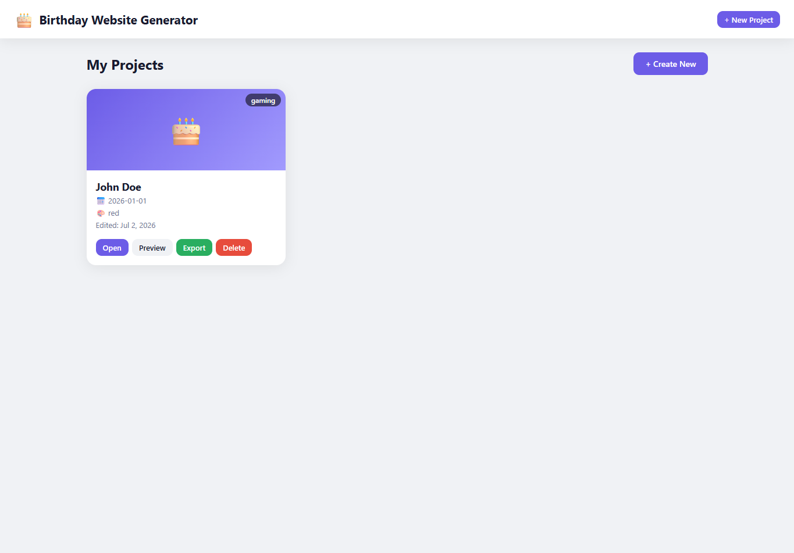
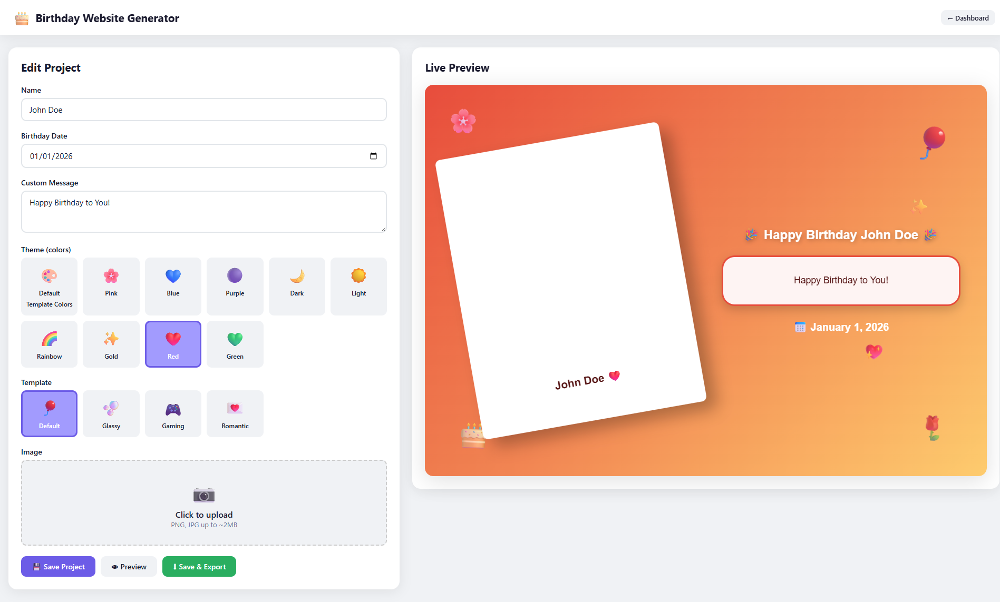
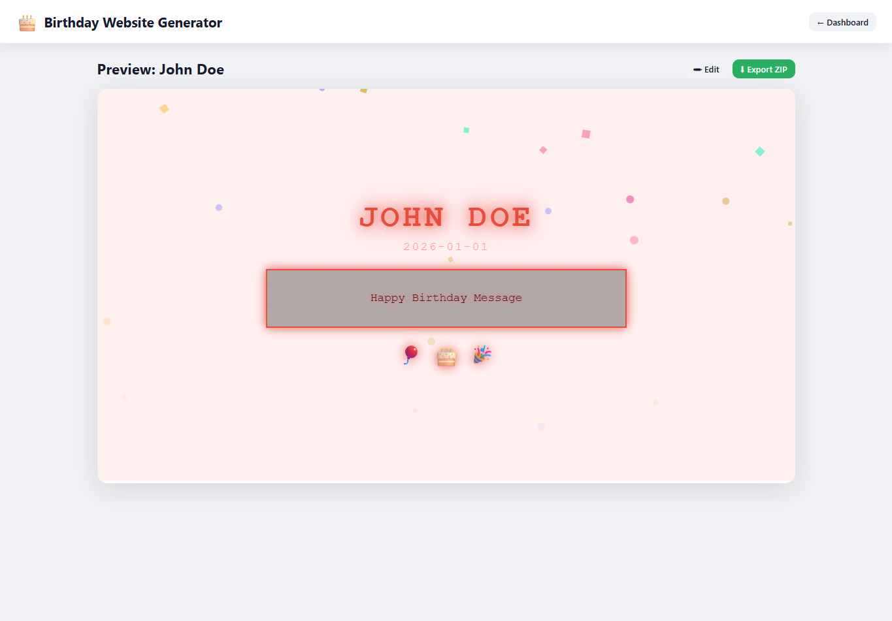

# 🎂 Birthday Website Generator

A modern, browser-based **Birthday Website Generator** built with **Vue 3**, **IndexedDB**, **JSZip**, and **FileSaver.js**.

Create personalized birthday websites without a backend or database server. Projects are stored locally in the browser using **IndexedDB**, rendered from real, file-based **templates**, and exported as fully functional standalone websites.

## 🚀 Live Demo

🌐 https://hassaanmub.github.io/BirthdaySiteGenerator-Vue/index.html

---

# 📖 Table of Contents

* [Overview](#-overview)
* [Features](#-features)
* [Technologies Used](#-technologies-used)
* [Project Structure](#-project-structure)
* [Template System](#-template-system)
* [Placeholders Reference](#-placeholders-reference)
* [Themes](#-themes)
* [Templates](#-templates)
* [Export System](#-export-system)
* [Data Storage](#-data-storage)
* [Adding a New Template](#-adding-a-new-template)
* [Screenshots](#-screenshots)
* [Running the Project](#-running-the-project)
* [Future Improvements](#-future-improvements)
* [Contributing](#-contributing)
* [License](#-license)

---

# 🎉 Overview

Birthday Website Generator is a lightweight web application that lets you build beautiful birthday websites for friends and family.

You can:

* Create multiple birthday website projects
* Pick from four hand-crafted templates, each with its own animations
* Recolor any template with color themes — or keep its original palette
* Upload a photo of the birthday person
* Add a name, date, and a custom message
* Watch the result update live while editing
* Preview the final site full-screen
* Export the project as a standalone website in a ZIP

The exported website is plain HTML — it can be hosted anywhere (GitHub Pages, Netlify, Vercel, Hostinger, etc.) with no dependencies on Vue or the generator itself.

---

# ✨ Features

### Dashboard

* Create unlimited birthday projects
* View all saved projects as cards with thumbnail, template, theme, and last-edited date
* Open, preview, export, or delete any project

### Editor

* Two-column, full-width layout: form on the left, **live preview** on the right
* The live preview is pinned at viewport height and re-renders on every keystroke
* Theme and template pickers with instant feedback
* Image upload (stored as Base64, max ~2 MB)
* Unsaved-changes guard when leaving the editor

### Preview

* Full-screen preview that fills everything below the toolbar
* Edit and Export ZIP actions right on the toolbar

### Templates & Theming

* Templates are real, self-contained HTML files - not generated strings
* Every template is wired with `{{ PLACEHOLDER }}` tokens for both content and colors
* A special **Default Template Colors** theme restores each template's original hardcoded palette
* All template animations live inside the template file itself - edit the file, and previews **and** exports pick the change up immediately

---

# 🛠 Technologies Used

| Technology | Purpose |
|---|---|
| **Vue 3** (CDN, no build step) | UI, reactivity, live preview |
| **IndexedDB** | Local project storage (CRUD) |
| **JSZip** | Building the export ZIP |
| **FileSaver.js** | Triggering the ZIP download |
| **Vanilla CSS** | App styling (`style.css`) |

No bundler, no npm install, no backend.

---

# 📂 Project Structure

```
BG-App/
├── index.html              # App shell (Vue templates for all views)
├── style.css               # App styling
├── script.js               # Themes, templates registry, IndexedDB service,
│                           # placeholder engine, export service, Vue app
│
├── templates/              # One folder per website template
│   ├── default/default.html
│   ├── glassy/glassy.html
│   ├── gaming/gaming.html
│   └── romantic/romantic.html
│
├── assets/
│   └── images/             # Shared decorative PNGs used by the templates
│
└── ReadmeScreenshots/
```

Each template is a **single self-contained HTML file** — its CSS and JS live inside it. There are no separate per-template stylesheets or scripts.

---

# 🧩 Template System

The heart of the app. When you preview or export a project:

1. The app fetches `templates/<id>/<id>.html` for the project's template (always fresh — file edits show up on the next preview).
2. `replacePlaceholders(content, project, theme)` swaps every `{{ TOKEN }}` in the file for project data and theme colors.
3. Asset paths (`../../assets/...`) are rewritten so images resolve correctly in the preview iframe and in the exported site.
4. **Preview:** the processed HTML is fed into an `<iframe srcdoc>`. The photo is injected as its Base64 data URL.
5. **Export:** the processed HTML becomes `index.html` in a ZIP, the photo becomes `assets/images/photo.png`, and every decorative image the template references is bundled alongside it.

Old projects saved with legacy template ids (`cute`, `elegant`) are transparently mapped to current templates.

---

# 🏷 Placeholders Reference

Templates can use any of these tokens (spaces inside the braces are optional - `{{NAME}}` and `{{ NAME }}` both work):

### Content

| Token | Replaced with |
|---|---|
| `{{ TITLE }}` | Page title — "Happy Birthday <name>!" |
| `{{ NAME }}` | The birthday person's name |
| `{{ MESSAGE }}` | The custom message |
| `{{ DATE }}` | The birthday date, formatted like "July 5, 2026" |
| `{{ IMAGE }}` | Base64 photo in previews, `assets/images/photo.png` in exports |

### Theme colors

| Token | Theme field |
|---|---|
| `{{ PRIMARY }}` | Main color |
| `{{ SECONDARY }}` | Softer companion color |
| `{{ ACCENT }}` | Third color for highlights |
| `{{ BACKGROUND }}` | Page background |
| `{{ SURFACE }}` | Cards / panels |
| `{{ TEXT }}` | Text color |
| `{{ GLOW }}` | Glow effects (falls back to primary) |

Unknown tokens are left untouched so typos are easy to spot.

> **Note:** because the color values are placeholders, opening a template file directly in the browser shows broken colors. Templates are meant to be viewed through the app's preview, which fills everything in.

---

# 🎨 Themes

Themes are plain JavaScript objects in `script.js` — no CSS is generated anywhere.

| Theme | Vibe |
|---|---|
| 🎨 **Default Template Colors** | Restores the selected template's original hardcoded palette |
| 🌸 Pink | Soft rose |
| 💙 Blue | Fresh sky blue |
| 🟣 Purple | Violet |
| 🌙 Dark | Deep navy with red/gold pops |
| ☀️ Light | Clean mint on white |
| 🌈 Rainbow | Dark base with vivid accents |
| ✨ Gold | Black & gold |
| ❤️ Red | Warm red |
| 💚 Green | Fresh green |

**Default Template Colors** is special: it isn't a fixed palette. It resolves to the original colors of whichever template is selected (defined in `TEMPLATE_DEFAULT_COLORS` in `script.js`), so every template can always look exactly as it was designed.

---

# 🖼 Templates

| Template | Description |
|---|---|
| 🎈 **Default** | Warm, playful classic card - tilted polaroid frame, floating emoji, vivid gradient |
| 🫧 **Glassy** | Frosted-glass panels over a blurred photo backdrop - rising bubbles, chrome stars, flying planes & rockets, a swinging microscope that frosts the title as it passes |
| 🎮 **Gaming** | Dark neon HUD - pixel fonts, glitching title, typed console lines, animated HP/XP bars, a Minecraft spider on a thread, floating game PNGs |
| 💌 **Romantic** | A storybook that opens on click - polaroid photo page, pulsing CSS heart, rising balloons, glowing corner heart |

All animation logic lives inside each template's own file.

---

# 📦 Export System

Clicking **Export** produces `BirthdayProject.zip` containing a real static website:

```
BirthdayProject.zip
├── index.html              # The processed template (CSS + JS inside)
└── assets/
    └── images/
        ├── photo.png       # The uploaded photo (if any)
        └── ...             # Every decorative PNG the template uses
```

* No CSS or JS files are split out - the site is one HTML file plus images.
* Decorative images are discovered by scanning the template for `../../assets/` references, fetched, and bundled automatically.
* Unzip and open, or drop the folder on any static host.

> Templates load icon fonts (Font Awesome) and Google Fonts from CDNs, so the exported site looks best with an internet connection.

---

# 💾 Data Storage

Projects live in the browser via **IndexedDB** (`BirthdayGeneratorDB` → `projects` store). Each project stores:

```js
{
  id, name, birthdayDate, message,
  theme,      // e.g. "pink" or "original"
  template,   // e.g. "gaming"
  image,      // Base64 data URL or null
  createdAt, updatedAt
}
```

Nothing ever leaves the browser until you export.

---

# ➕ Adding a New Template

This is the whole point of the architecture - three steps, no app-code changes beyond one registry entry:

1. Create the folder and file:

   ```
   templates/myTemplate/myTemplate.html
   ```

   Make it fully self-contained (CSS + JS inline) and use the placeholders from the reference above. Reference shared images as `../../assets/images/<file>.png`.

2. Register it in `TEMPLATES` in `script.js`:

   ```js
   myTemplate: {
     id: 'myTemplate', name: 'My Template', emoji: '🎁',
     description: 'Something amazing',
     supportedThemes: ['pink', 'dark'],
   },
   ```

3. (Optional) Add its original palette to `TEMPLATE_DEFAULT_COLORS` so the **Default Template Colors** theme works for it.

Done - it appears in the editor's template picker automatically.

---

# 📷 Screenshots

## Dashboard



## Editor with Live Preview



## Full Preview



---

# ▶ Running the Project

The app is fully client-side, but it **must be served over HTTP** - templates are loaded with `fetch()`, which browsers block on `file://`.

From the project folder, run any static server:

```bash
python -m http.server
```

or

```bash
npx serve
```

or use the **Live Server** extension in VS Code, then open `index.html` in the browser.

No installation, build step, or backend required.

---

# 🚀 Future Improvements

* Background music support
* Additional templates
* Custom fonts
* Confetti customization
* GIF support
* Video backgrounds
* Countdown timer
* Password-protected birthday pages
* Shareable project links
* Drag-and-drop editor
* Multi-language support
* Import existing projects
* Cloud synchronization
* PWA (offline support)

---

# 🤝 Contributing

Contributions are welcome!

Ideas, bug fixes, UI improvements, new templates, animations, and feature additions are greatly appreciated. Feel free to fork the project and submit a Pull Request.

---

# 📄 License

This project is open-source and available under the MIT License.

---

# ❤️ Acknowledgements

Built using:

* Vue 3
* IndexedDB
* JSZip
* FileSaver.js

Special thanks to the open-source community for making browser-based applications like this possible.
